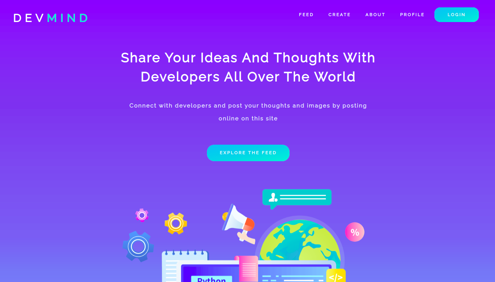

# DevMind

<div align="center">  
<br>

</p>

</div>

<div align="center">  
<br>
 
[](https://github.com/NikhilSharma03/DevMind) 
[](https://github.com/NikhilSharma03/DevMind)

</div>

<br>

<h3 align="center"> 🌟 DevMind is a social media platform for developers 💻 to share their ideas and thoughts with developers all over the world 🚀</h3>

<br>

## Technology Stack

<h3 align="center">Languages</h3>

<div align="center">

   

</div>

<br>

<h3 align="center">Library & Frameworks</h3>

<div align="center">

   
[](https://reactjs.org/docs/getting-started.html)

</div>

<br>

<h3 align="center">Project Management Tools</h3>

<div align="center">

 

</div>

<br>

## Setup and Installation

First install the `server` dependency,

```
make setup-server-libs
```

Now to run server, first add `Environment Variables` by creating a new `.env` file at `root` level and add the contents following `.env.example`

Once you have added correct credentials, start the server

```
make run-server
```

To get auto reload, start the dev server,

```
make run-server-dev
```

If using `docker compose`, then first build the image

```
make compose-dev-build
```

Now start the dev server

```
make compose-dev-up
```

To access logs

```
make compose-dev-logs
```

To shut down the server

```
make compose-dev-down
```

<br>

Now to run `UI`, First install the UI dependency,

```
make setup-ui-libs
```

Now to run UI, first add `Environment Variables` by creating a new `.env` file in `ui` folder and add the contents following `.env.example`

Once you have added correct credentials, start the ui

```
make run-ui-dev
```

To build ui,

```
make build-ui
```

<br>

# License

<div align="center">  
<br>

</p>

<br>
</div>
